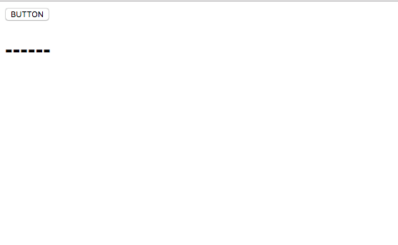
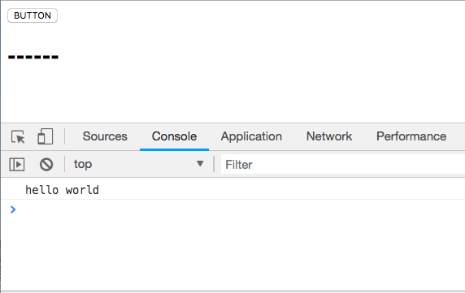
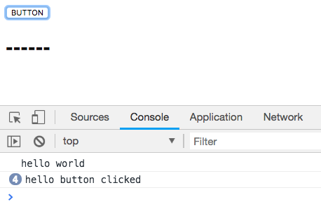
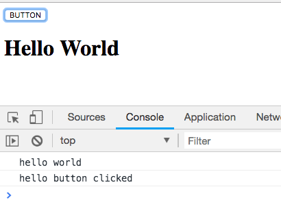

## Index

1. Prepare index.html file
2. Prepare main.js file and show hello world on console
3. Get `button` onclick event
4. Change `h1` text
5. Switch `h1` text

***

## Step1
Prepare the index.html file

_index.html_
```html
<!DOCTYPE html>
<html>
  <head>
    <title>Hello World button tutorial</title>
  </head>

  <body>
    <button id="button">BUTTON</button>
    <h1 id="header">------</h1>
  </body>

</html>
```



***

## Step2
Prepare main.js file and show hello world on console

_index.html_
```html
<body>
  <button id="button">BUTTON</button>
  <h1 id="header">------</h1>
  <script src='./main.js'></script>
</body>
```


_main.js_
```js
console.log("hello world");
```



***

### Step3
Get `button` onclick event

_main.js_
```js
console.log("hello world");

const button = document.getElementById('button');

const onButtonClicked = () => {
  console.log("hello button clicked");
}

button.addEventListener('click', onButtonClicked);
```



***

### Step4
Change `h1` text

_main.js_
```js
const onButtonClicked = () => {
  console.log("hello button clicked");
  const h1 = document.getElementById('header');
  h1.textContent = "Hello World";
}
```



***
#### ⚠️ Now we want to switch the word "Hello World" <-> "------"

### Step5
Switch `h1` text

```js
const onButtonClicked = () => {
  console.log("hello button clicked");
  const h1 = document.getElementById('header');

  if(h1.textContent === "Hello World") {
    h1.textContent = "------";
  } else {
    h1.textContent = "Hello World";
  }
}
```